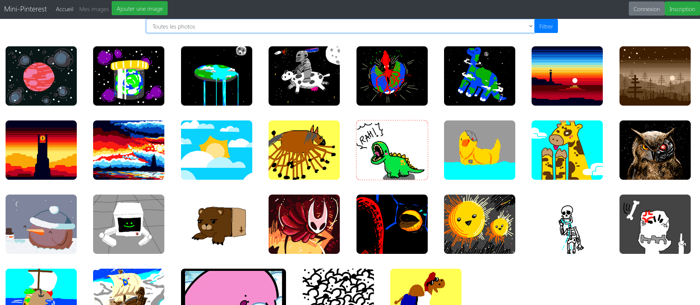

# MiniPinterest

Un projet utilisant php et phpMyAdmin pour gérer une plateforme de publication d'image avec une gestion de comptes utilisateurs

Ce projet a été effectué début 2021 dans le cadre de l'UE "Bases de données web" en L2.

## Attention
**Ce projet est fonctionnel mais pas sécurisé pour un déploiement sur les internets!** \
Il doit être protégé contre les injections SQL avant un usage public.

## Installation
* Installez [XAMPP](https://www.apachefriends.org/download.html)
* Effacez le contenu de htdocs et remplacez le par ce projet
* Lancez [phpMyAdmin](http://localhost/phpmyadmin) et chargez database.sql
* Connectez vous à [localhost](http://localhost/): félicitations! Le projet est en place! \
  **Comptes:**
  - *admin*, mdp: *admin*
  - *Eggman*, mdp: *EGG*
